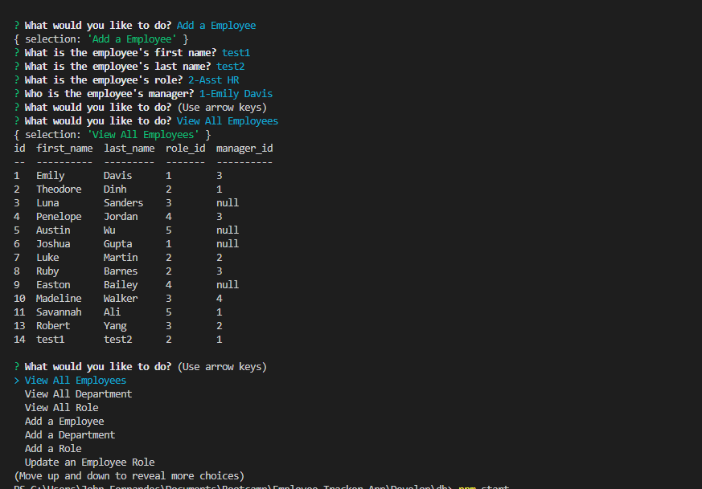

# Employee-Tracker-App

# Team-Profile-Generator

  ## Table of Content 📖
  - [Description](#description)
  - [User Story](#user-story)
  - [Acceptance Criteria](#acceptance-criteria)
  - [Installation](#installation)
  - [Credit](#credit)
  - [Mock-Up](#mock-up)
  - [Reach-me](#reach-me)
  - [GitHub-name](#github-name)
  - [Video-Link](#video-link)

## Description
Employee Tracker App is a command-line application to manage a company's employee database, using Node.js, Inquirer, and MySQL.
The Owner can view the employee details, their role and the various department in an organization.

## User Story

```md
AS A business owner
I WANT to be able to view and manage the departments, roles, and employees in my company
SO THAT I can organize and plan my business
```

## Acceptance Criteria

```md
GIVEN a command-line application that accepts user input
WHEN I start the application
THEN I am presented with the following options: view all departments, view all roles, view all employees, add a department, add a role, add an employee, and update an employee role
WHEN I choose to view all departments
THEN I am presented with a formatted table showing department names and department ids
WHEN I choose to view all roles
THEN I am presented with the job title, role id, the department that role belongs to, and the salary for that role
WHEN I choose to view all employees
THEN I am presented with a formatted table showing employee data, including employee ids, first names, last names, job titles, departments, salaries, and managers that the employees report to
WHEN I choose to add a department
THEN I am prompted to enter the name of the department and that department is added to the database
WHEN I choose to add a role
THEN I am prompted to enter the name, salary, and department for the role and that role is added to the database
WHEN I choose to add an employee
THEN I am prompted to enter the employee’s first name, last name, role, and manager, and that employee is added to the database
WHEN I choose to update an employee role
THEN I am prompted to select an employee to update and their new role and this information is updated in the database 
```

## Installation

VS code, Node js, npm Inquirer(inquirer@8.2.4.)packages.
commands > npm init -y (to cteate package.json), npm install mysql2, npm install console.table.
## Credit

UW Bootcamp Instructors and TA's.

## Mock-Up

The following video shows an example of the application being used from the command line:

[](https://2u-20.wistia.com/medias/2lnle7xnpk)

## Reach-me

jessyjosephine.mscit@gmail.com

## GitHub-name

Github: https://github.com/Jessyjdi

## Video-Link

https://drive.google.com/file/d/1ib9ozcxHqc4u9ePJt5wd7AFzq7jFsGjE/view


